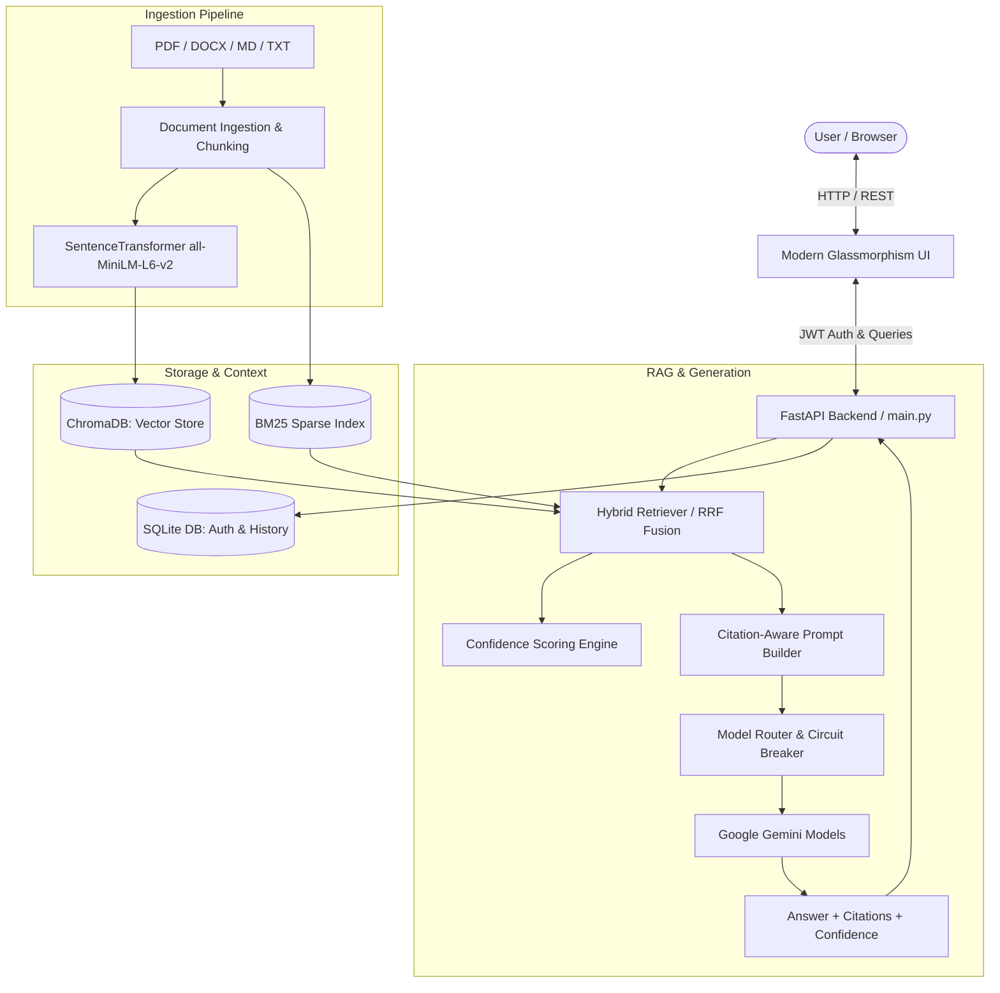

<div align="center">

# 🏛️ Athena
### Enterprise-Grade Agentic RAG Knowledge & Retrieval System

[](https://fastapi.tiangolo.com/)
[](https://www.trychroma.com/)
[](https://ai.google.dev/)
[](https://huggingface.co/sentence-transformers/all-MiniLM-L6-v2)
[](https://opensource.org/licenses/MIT)

**Athena** is a high-performance, modular Retrieval-Augmented Generation (RAG) platform featuring **Hybrid Retrieval (Vector + BM25)**, **Calibrated Grounding Confidence Scoring**, **Interactive Citation Highlights**, and **Multi-Tier Model Failover with Circuit Breaking**.

</div>

---

## 🌟 Key Features

- 🔍 **Hybrid Retrieval Engine**: Fuses dense semantic vector embeddings (`all-MiniLM-L6-v2`) with sparse keyword indexing (`BM25Okapi`) using **Reciprocal Rank Fusion (RRF, k=60)** for superior recall and precision.
- 🎯 **Calibrated Confidence Scoring**: Evaluates grounding confidence for every response (High 🟢 / Medium 🟡 / Low 🔴) based on semantic proximity thresholds.
- 📑 **Interactive Source Citations**: Inline clickable chips (`[1]`, `[2]`, `[1][2]`) with interactive slide-in drawer inspectors displaying exact source document snippets and locations.
- ⚡ **Model Circuit Breaker & Resilient Routing**: Intelligent failover across Gemini models (`gemini-3.5-flash-lite`, `gemini-3.5-flash`, `gemini-3.7-flash`, `gemini-3.1-flash-lite`) with 60s cooldowns on rate limits, maintaining sub-2s response latencies.
- 🔐 **Secure Multi-User System**: JWT authentication, bcrypt password hashing, and user-isolated conversation threads stored in SQLite.
- 📂 **Multi-Format Ingestion Pipeline**: Ingest and index `.pdf`, `.docx`, `.md`, and `.txt` documents page-by-page and chunk-by-chunk.
- 📊 **Quantitative Evaluation Suite**: Built-in benchmark harness (`evaluate.py`) evaluating Precision@k, Recall@k, MRR, Token F1, and semantic cosine similarity.

---

## 🏗️ Architecture & Workflow



---

## 📊 Benchmark & Evaluation Results

Tested on a 25-question ground-truth evaluation set across technical textbooks, academic surveys, and domain notes:

### 1. Retrieval Performance Comparison
| Metric | Vector-Only (Dense) | Hybrid (Dense + BM25 RRF) | Relative Gain |
|---|---|---|---|
| **Precision@3** | `0.7600` | **`0.8133`** | **+7.01%** |
| **Precision@5** | `0.7120` | **`0.7600`** | **+6.74%** |
| **Recall@3** | `0.9200` | **`1.0000`** | **+8.70%** |
| **Recall@5** | `0.9600` | **`1.0000`** | **+4.17%** |
| **MRR (Mean Reciprocal Rank)** | `0.8833` | **`0.9267`** | **+4.91%** |

### 2. Answer Quality & Latency Profile
- **Mean Semantic Cosine Similarity**: `0.7805` (78.05% similarity against ground-truth references)
- **High Confidence Tier Distribution**: 36% High (Avg Sim: `0.7840`), 52% Medium (Avg Sim: `0.7838`), 12% Low (Avg Sim: `0.7554`)
- **Median End-to-End Latency**: `1,948.3 ms` (~1.95s)
- **P95 End-to-End Latency**: `2,827.7 ms` (~2.83s)

---

## 🚀 Quick Start

### 1. Prerequisites
- Python 3.10+
- Google Gemini API Key ([Get one here](https://aistudio.google.com/))

### 2. Clone the Repository
```bash
git clone https://github.com/sibirajan777/Athena.git
cd Athena
```

### 3. Install Dependencies
```bash
pip install -r requirements.txt
```

### 4. Configure Environment Variables
Create a `.env` file in the root directory:
```env
GEMINI_API_KEY=your_actual_gemini_api_key_here
JWT_SECRET=your_super_secret_jwt_key_here
```

### 5. Launch the Application
```bash
python -m uvicorn backend.main:app --host 127.0.0.1 --port 8000
```
Open your browser and navigate to:
- **Application Web UI**: [http://127.0.0.1:8000](http://127.0.0.1:8000)
- **Swagger API Docs**: [http://127.0.0.1:8000/docs](http://127.0.0.1:8000/docs)

---

## 🧪 Running Evaluations & Tests

### Run Quantitative Evaluation Benchmark
```bash
python evaluate.py
```
This runs the full evaluation pipeline and generates:
- `eval_report.md` — Formatted Markdown report
- `eval_results.json` — Detailed per-question metrics
- `eval_comparison.png` — 300 DPI high-resolution comparison chart

### Run System Test Suite
```bash
python test_full_system.py
```

---

## 📁 Project Structure

```
Athena/
├── backend/
│   ├── main.py                  # FastAPI application & REST routing
│   └── services/
│       ├── db.py                # SQLite database manager & JWT auth
│       ├── ingest.py            # Document parsing, chunking & ChromaDB
│       ├── retrieve.py          # Dense vector & hybrid retrieval
│       └── generate.py          # Prompt construction, confidence & LLM routing
├── frontend/
│   ├── index.html               # Main single-page application
│   ├── style.css                # Dark mode glassmorphism design system
│   ├── app.js                   # Client app logic, citations & drawer UI
│   ├── auth.html / auth.css     # Authentication UI
│   └── splash.js                # Welcome & interaction animations
├── data/                        # Document upload directory
├── eval_dataset.json            # 25-item ground truth test dataset
├── evaluate.py                  # Quantitative evaluation framework
├── eval_report.md               # Academic benchmark report
├── eval_comparison.png          # Performance comparison chart
├── pyproject.toml               # Python project configuration
├── requirements.txt             # Pip dependencies
└── README.md                    # Project documentation
```

---

## 📜 License
This project is open-source under the [MIT License](LICENSE).
