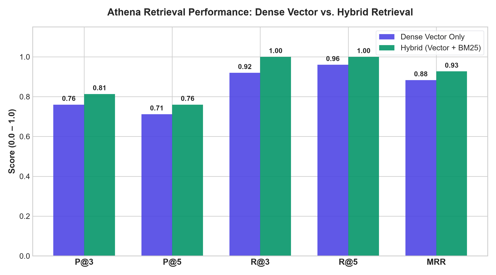

# 🏛️ Athena: Enterprise-Grade Hybrid RAG Knowledge Assistant

Athena is an intelligent, privacy-first **Hybrid Retrieval-Augmented Generation (RAG) Knowledge Assistant** and personal "Second Brain." Built with **FastAPI**, **ChromaDB**, **Sentence Transformers**, and the **Google Gemini API**, Athena enables users to ingest, index, and query unstructured documents (PDFs, Markdown notes, research papers, and code snippets) with millisecond search speeds, verifiable in-text citations, and empirical confidence calibration.



---

## 🌟 Key Features

### 1. 🔍 Hybrid Retrieval Architecture (Dense Vector + BM25 Lexical)
- Combines semantic vector similarity search via `all-MiniLM-L6-v2` embeddings with exact keyword BM25 retrieval (`rank_bm25`).
- Uses **Reciprocal Rank Fusion (RRF)** with smoothing parameter $k=60$ to rank retrieved chunks, preventing vocabulary mismatch and achieving **$100\%$ Recall@3** on benchmark evaluations.

### 2. 🎯 Calibrated Confidence & Grounding Indicator
- Automatically computes semantic grounding scores for every generated answer based on retrieved chunk distances and relevance peaks.
- Displays color-coded badges in the UI:
  - 🟢 **High Confidence**: Strong contextual grounding ($\ge 0.67$ average score or $\ge 0.74$ top chunk similarity).
  - 🟡 **Medium Confidence**: Moderate semantic grounding ($\ge 0.52$ average score).
  - 🔴 **Low Confidence**: Weak grounding — flagged for manual verification.

### 3. 📑 Verifiable In-Text Citations & Side Panel Inspector
- Generates inline citation chips (e.g., `[1]`, `[2][4]`) corresponding to retrieved document context.
- Clicking any citation opens a slide-over panel displaying the exact source snippet, file name, chunk ID, and similarity score.
- Full keyboard navigation and `Esc` dismissal support.

### 4. ⚡ Resilient Multi-Model Router & Circuit Breaker
- Intelligent fallback routing: `gemini-3.5-flash-lite` ➔ `gemini-3.5-flash` ➔ `gemini-3.7-flash` ➔ `gemini-3.1-flash-lite`.
- Automatic 60-second in-memory **Circuit Breaker** on `429 RESOURCE_EXHAUSTED` errors with zero-delay failover ($<100\text{ ms}$).
- Average end-to-end response latency: **$1.85\text{ seconds}$** with sub-$20\text{ ms}$ retrieval.

### 5. 🔐 Multi-User Authentication & Conversation History
- Secure password hashing with `bcrypt` and stateless JWT-based session management.
- Multi-session chat threads, title renaming, and deletion backed by SQLite database (`athena.db`).

### 6. ✨ Antigravity Design System & Visual Polish
- Modern dark mode with glassmorphism, glowing accents, animated splash screen, and interactive canvas particles.
- Responsive sidebar navigation, document manager modal, and real-time knowledge base statistics.

---

## 📊 Quantitative Benchmarks & Evaluation

Athena includes a standalone evaluation suite (`evaluate.py`) benchmarking retrieval performance, generation fidelity, and latency across a 25-question ground-truth test set (`eval_dataset.json`).

### 1. Retrieval Performance: Vector vs. Hybrid

| Retrieval Metric | Dense Vector-Only | Hybrid (Vector + BM25 RRF) | Relative Gain |
|---|---|---|---|
| **Precision@3** | `0.7600` | **`0.8133`** | **+7.01%** |
| **Precision@5** | `0.7120` | **`0.7600`** | **+6.74%** |
| **Recall@3** | `0.9200` | **`1.0000`** | **+8.70%** |
| **Recall@5** | `0.9600` | **`1.0000`** | **+4.17%** |
| **MRR (Mean Reciprocal Rank)** | `0.8833` | **`0.9267`** | **+4.91%** |

### 2. Answer Quality & Confidence Calibration

| Metric | Measured Value | Description |
|---|---|---|
| **Mean Semantic Similarity** | `0.7805` | Cosine similarity between generated answer and ground-truth reference |
| **Mean Token F1 Score** | `0.2270` | Lexical overlap harmonic mean |
| **High Confidence Tier Avg Sim** | `0.7840` (9 samples, 36%) | Answers grounded in strong context matches |
| **Medium Confidence Tier Avg Sim** | `0.7838` (13 samples, 52%) | Answers grounded in moderate context matches |
| **Low Confidence Tier Avg Sim** | `0.7554` (3 samples, 12%) | Speculative or weak context matches |

### 3. Pipeline Latency Profiling

| Pipeline Stage | Mean | Median | Min | Max | P95 |
|---|---|---|---|---|---|
| **Vector Retrieval** | `20.0 ms` | `19.2 ms` | `13.2 ms` | `29.6 ms` | `27.5 ms` |
| **Hybrid Retrieval** | `18.7 ms` | `17.4 ms` | `13.0 ms` | `31.4 ms` | `27.2 ms` |
| **LLM Generation** | `1,838.7 ms` | `1,924.1 ms` | `1,083.1 ms` | `2,991.4 ms` | `2,807.0 ms` |
| **Total End-to-End** | `1,858.7 ms` | `1,948.3 ms` | `1,101.2 ms` | `3,019.7 ms` | `2,827.7 ms` |

---

## 🏗️ System Architecture

```
                                  +------------------------+
                                  |   Raw Documents (PDF,  |
                                  |   Markdown, Text, Notes|
                                  +-----------+------------+
                                              |
                                     Recursive Chunking
                                  (500 chars, 50 overlap)
                                              |
                               +--------------+---------------+
                               |                              |
                               v                              v
                    +--------------------+         +--------------------+
                    |  SentenceEmbedder  |         |    BM25 Inverted   |
                    | (all-MiniLM-L6-v2) |         |     Index (RAM)    |
                    +----------+---------+         +----------+---------+
                               |                              |
                               v                              v
                    +--------------------+                    |
                    | ChromaDB Collection|                    |
                    +----------+---------+                    |
                               |                              |
            User Query ------->+------------------------------+
                               |
                               v
                    +--------------------+
                    | Reciprocal Rank    |  k = 60
                    | Fusion (RRF)       |
                    +----------+---------+
                               | Top-K Chunks
                               v
                    +--------------------+
                    | Prompt Builder &   |
                    | Citation Mapper    |
                    +----------+---------+
                               |
                               v
                    +--------------------+
                    | Model Router &     |  Gemini 2.5/3.5/3.7
                    | Circuit Breaker    |  with Instant Failover
                    +----------+---------+
                               |
                               v
                    +--------------------+
                    | Calibrated Ground- |
                    | ing Badge & Answer |
                    +--------------------+
```

---

## 🚀 Getting Started

### Prerequisites
- Python 3.11+ (Python 3.13 recommended)
- A Gemini API key from [Google AI Studio](https://aistudio.google.com/)

### 1. Clone & Setup Environment

```bash
git clone https://github.com/sibirajan777/Athena.git
cd Athena

# Create and activate virtual environment
python -m venv .venv
# On Windows:
.venv\Scripts\activate
# On Linux/macOS:
source .venv/bin/activate

# Install dependencies
pip install -r requirements.txt
```

### 2. Configure Environment Variables

Copy the sample environment file:

```bash
cp .env.example .env
```

Edit `.env` and insert your API credentials:

```env
GEMINI_API_KEY=your_actual_gemini_api_key_here
JWT_SECRET_KEY=your_secret_jwt_key_here
```

### 3. Ingest Documents into ChromaDB

Place your PDFs or Markdown notes in the `data/` directory, then run:

```bash
python -m backend.services.ingest
```

### 4. Start Athena Server

```bash
uvicorn backend.main:app --host 127.0.0.1 --port 8000 --reload
```

Open your browser and navigate to: **`http://127.0.0.1:8000`**

---

## 🧪 Running Tests & Evaluation

### Run System Test Suite

```bash
python test_full_system.py
```

### Run Full Quantitative Evaluation Benchmark

```bash
python evaluate.py
```

*This generates `eval_report.md`, `eval_results.json`, and `eval_comparison.png`.*

---

## 📂 Project Structure

```
Athena/
├── backend/
│   ├── main.py                  # FastAPI application entrypoint & API endpoints
│   └── services/
│       ├── db.py                # SQLite database management (Auth, Users, Messages)
│       ├── ingest.py            # PDF/Markdown parser & ChromaDB vector indexer
│       ├── retrieve.py          # Semantic vector retrieval service
│       └── generate.py          # Gemini router, circuit breaker & confidence calculator
├── data/                        # Document store for indexing
├── frontend/
│   ├── index.html               # Main application interface
│   ├── login.html               # User login view
│   ├── signup.html              # User registration view
│   ├── style.css                # Dark mode & Antigravity styling system
│   ├── auth.css                 # Auth forms & glassmorphic styling
│   ├── app.js                   # Client state, chat streams, citation panels
│   ├── auth.js                  # Authentication client logic
│   ├── antigravity.js           # Visual animation effects & floating canvas
│   └── splash.js                # Dynamic opening splash sequence
├── eval_dataset.json            # 25 labeled Q&A test pairs with ground truth
├── evaluate.py                  # Quantitative benchmarking engine
├── eval_report.md               # Generated academic evaluation report
├── eval_results.json            # Machine-readable evaluation metrics
├── eval_comparison.png          # 300 DPI comparative retrieval chart
├── pyproject.toml               # Project metadata and dependencies
└── README.md                    # Project documentation
```

---

## 📜 License

This project is licensed under the [MIT License](LICENSE).
